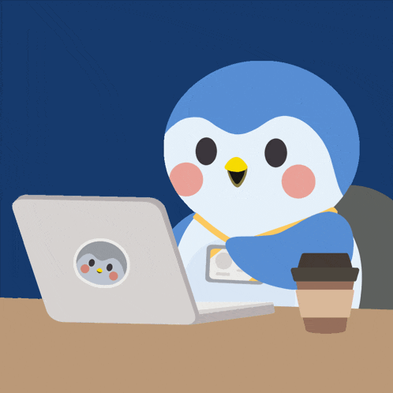

  
  
  <h1>Alicia Ros</h1>
  
<b>Desarrolladora Web Full-Stack & Especialista Visual</b>

  
<i>Transformando la lógica del código en experiencias visuales interactivas</i>

 

## ☕ Sobre mí

Soy una desarrolladora web con un perfil híbrido. Poseo formación previa con un grado en **Historia del Arte** y el **Máster de Profesorado** lo que me aporta un ojo crítico para la composición estética y una alta capacidad para la organización, metodologías ágiles y documentación técnica.

Actualmente curso el Grado Superior en **Desarrollo de Aplicaciones Web (DAW)** para potenciar arquitecturas de software robustas y eficientes.

* 💼 **Experiencia real:** He realizado mis prácticas profesionales en la agencia **Posiziona**, desarrollando portfolios fotográficos completos, soluciones corporativas y la arquitectura de múltiples blogs optimizados.
* 🌿 **Filosofía de trabajo:** Orientada al desarrollo de código limpio, atención a los detalles visuales y al rendimiento.

## 🛠️ Herramientas & Tecnologías

  

  

  

 

## 🌙 Proyectos & Líneas de investigación

* 🚀 **Despliegue CMS & Desarrollo Web:** Experiencia en la creación, migración y optimización de sitios corporativos y blogs basados en el ecosistema WordPress.
* 🎨 **Investigación interactiva (Three.js):** Actualmente investigando y aprendiendo el desarrollo de gráficos 3D en la web con **Three.js**, enfocada en la creación de mi futuro portfolio interactivo.
* 📖 **Experimentación lógica:** Experimentando desarrollo de estructuras lógicas y scripts en **Ren'Py** para la creación de proyectos de narrativa visual.

## 🐍 Snake

Este gráfico se actualiza automáticamente con mis aportes diarios en GitHub.

  

 

  Hecho con 🤍 y mucho café

